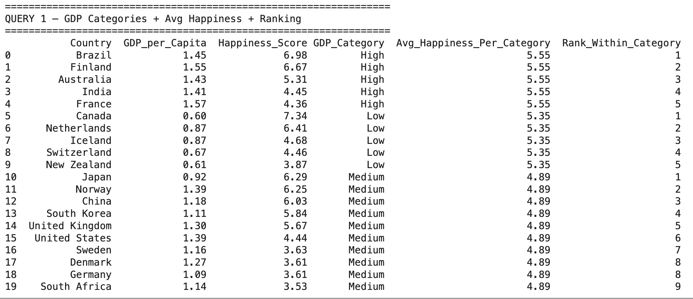
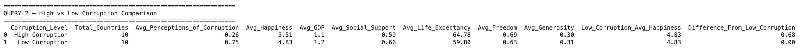

# World Happiness Dataset — SQL Analysis

## Overview

This project performs SQL-based analysis on the **World Happiness Dataset**
containing **20 countries** and **8 features**. The dataset was loaded from a
CSV file into a **SQLite database** using Python, and two SQL queries were
developed to extract meaningful insights about GDP categories, happiness
rankings, and corruption perception comparisons.

---

## Dataset

| Column | Type | Description |
|---|---|---|
| `Country` | Text | Country name |
| `Happiness_Score` | Float | Overall happiness score (main outcome variable) |
| `GDP_per_Capita` | Float | Economic output per person |
| `Social_Support` | Float | Having someone to count on in times of need |
| `Healthy_Life_Expectancy` | Float | Expected years of healthy life |
| `Freedom_to_Make_Choices` | Float | Freedom to choose life path |
| `Generosity` | Float | Charitable giving measure |
| `Perceptions_of_Corruption` | Float | Level of trust in government and business |

---

## Setup

### Step 1 — Import Libraries

```python
import pandas as pd
import seaborn as sns
import matplotlib.pyplot as plt
import numpy as np
from scipy import stats
import sqlite3
```

All required libraries are imported upfront. `sqlite3` is Python's built-in
library for working with SQLite databases — no separate installation needed.

---

### Step 2 — Load CSV File

```python
# Note: This cell only works in Google Colab
from google.colab import files
uploaded = files.upload()

df = pd.read_csv("world_happiness_dataset.csv")
print(df.head())
```

The CSV file is uploaded and loaded into a pandas DataFrame. `df.head()`
confirms the first 5 rows loaded correctly with all 8 columns.

---

### Step 3 — Create SQLite Database

```python
# Create/connect to SQLite database
conn = sqlite3.connect('happiness.db')

# Push DataFrame into SQLite as a table
df.to_sql(
    'happiness',          # table name inside the database
    conn,                 # connection to use
    if_exists='replace',  # replace table if it already exists
    index=False           # don't write pandas index as a column
)

# Verify — read back to confirm
verify = pd.read_sql("SELECT * FROM happiness LIMIT 5", conn)
print("Database created successfully!")
print(f"Total rows: {pd.read_sql('SELECT COUNT(*) as count FROM happiness', conn)['count'][0]}")
```

**Why SQLite?**
> The data lives in a CSV/pandas DataFrame — not a database. SQLite is a
> lightweight database that runs entirely inside Python with no server needed.
> `df.to_sql()` pushes the DataFrame directly into SQLite so we can run
> proper SQL queries against it.

**Key parameters:**

| Parameter | Value | Reason |
|---|---|---|
| `if_exists='replace'` | Replace | Avoids duplicate data if cell is re-run |
| `index=False` | False | Keeps table clean — no extra index column |

**Result:** ✅ 20 rows loaded successfully into `happiness` table.

---

## SQL Query 1 — GDP Categories, Average Happiness & Country Ranking

### Purpose
This query answers: **"Do wealthier countries have happier citizens?"**
It groups countries into GDP categories, calculates average happiness per
group, and ranks each country within its group.

### Setting GDP Boundaries

Before writing the query, the GDP distribution was checked:

```python
print(df['GDP_per_Capita'].describe())
```

```
min     0.600
25%     0.9075   ← Q1 used as Low/Medium boundary
50%     1.170
75%     1.395    ← Q3 used as Medium/High boundary
max     1.570
```

**Q1 (0.9075) and Q3 (1.395) were chosen as boundaries** because they split
the data based on the actual distribution rather than arbitrary numbers —
giving three balanced, meaningful groups.

| Category | GDP Range | Countries |
|---|---|---|
| Low | < 0.9075 | Canada, Netherlands, Iceland, Switzerland, New Zealand |
| Medium | 0.9075 – 1.395 | Japan, Norway, China, South Korea, UK, USA, Sweden, Denmark, Germany, South Africa |
| High | > 1.395 | Brazil, Finland, Australia, India, France |

---

### Full Query

```sql
SELECT
    Country,
    GDP_per_Capita,
    Happiness_Score,
    GDP_Category,

    -- AVG uses window WITHOUT ORDER BY → true group average
    ROUND(AVG(Happiness_Score) OVER (
        PARTITION BY GDP_Category
    ), 2) AS Avg_Happiness_Per_Category,

    -- RANK uses window WITH ORDER BY → correct ranking
    DENSE_RANK() OVER (
        PARTITION BY GDP_Category
        ORDER BY Happiness_Score DESC
    ) AS Rank_Within_Category

FROM (
    SELECT *,
        CASE
            WHEN GDP_per_Capita < 0.9075 THEN 'Low'
            WHEN GDP_per_Capita <= 1.395 THEN 'Medium'
            ELSE                              'High'
        END AS GDP_Category
    FROM happiness
)
ORDER BY GDP_Category, Rank_Within_Category
```

---

### Step-by-Step Explanation

#### Step 1 — Subquery: Create GDP_Category using CASE WHEN

```sql
SELECT *,
    CASE
        WHEN GDP_per_Capita < 0.9075 THEN 'Low'
        WHEN GDP_per_Capita <= 1.395 THEN 'Medium'
        ELSE                              'High'
    END AS GDP_Category
FROM happiness
```

**Purpose:** Assigns a GDP category label to every country based on their
GDP value. `CASE WHEN` works exactly like if/elif/else in Python.

**Why use a subquery here?**
> Without a subquery, `CASE WHEN` would need to be repeated 3 times — once
> for the column label, once inside `AVG()`, and once inside `RANK()`. The
> subquery defines `GDP_Category` ONCE and the outer query reuses it freely,
> making the query cleaner and more efficient.

**Logic:**
```
GDP < 0.9075          → 'Low'     (below Q1)
0.9075 ≤ GDP ≤ 1.395  → 'Medium'  (between Q1 and Q3)
GDP > 1.395           → 'High'    (above Q3)
```

---

#### Step 2 — AVG() OVER (PARTITION BY): Average Happiness Per Category

```sql
ROUND(AVG(Happiness_Score) OVER (
    PARTITION BY GDP_Category
), 2) AS Avg_Happiness_Per_Category
```

**Purpose:** Calculates the average happiness score for all countries within
the same GDP category and displays it on every row of that category.

**Key concepts:**

| Keyword | Role |
|---|---|
| `AVG(Happiness_Score)` | Calculates the mean happiness score |
| `OVER` | Turns AVG into a window function — works across a group of rows |
| `PARTITION BY GDP_Category` | Splits rows into groups by category — like `groupby()` in pandas |
| `ROUND(..., 2)` | Rounds result to 2 decimal places |

**Why NO `ORDER BY` inside this window?**
> Adding `ORDER BY` inside a window with `AVG()` causes a **cumulative
> running average** — it adds one row at a time instead of averaging the
> whole group. Without `ORDER BY`, it correctly averages all rows in the
> partition at once.

**Result:** Every country in the same category sees the same average value:
```
High   → 5.55 for all 5 High GDP countries
Low    → 5.35 for all 5 Low GDP countries
Medium → 4.89 for all 10 Medium GDP countries
```

---

#### Step 3 — DENSE_RANK() OVER (PARTITION BY ... ORDER BY): Rank Within Category

```sql
DENSE_RANK() OVER (
    PARTITION BY GDP_Category
    ORDER BY Happiness_Score DESC
) AS Rank_Within_Category
```

**Purpose:** Ranks each country by happiness score within its GDP category.
Rank 1 = happiest country in that category.

**Key concepts:**

| Keyword | Role |
|---|---|
| `DENSE_RANK()` | Assigns rank numbers — no gaps after ties |
| `PARTITION BY GDP_Category` | Restarts ranking from 1 for each category |
| `ORDER BY Happiness_Score DESC` | Highest happiness = Rank 1 |

**Why `DENSE_RANK()` and not `RANK()`?**

| Function | Tie behaviour | Example |
|---|---|---|
| `RANK()` | Skips numbers after ties | 1, 2, 2, **4** (skips 3) |
| `DENSE_RANK()` | No gaps after ties | 1, 2, 2, **3** (no skip) |

> `DENSE_RANK()` gives cleaner, more intuitive ranking — especially when
> countries share the same happiness score.

---

### Query 1 Results



### Key Findings from Query 1
- **High GDP countries** have the highest average happiness (**5.55**)
- **Low GDP countries** average (**5.35**) is surprisingly close to High —
  suggesting GDP alone does not fully determine happiness
- **Medium GDP countries** have the lowest average happiness (**4.89**)
- **Canada** (Low GDP category) is the happiest individual country with
  score **7.34** — an interesting outlier showing GDP is not the only factor

---

## SQL Query 2 — High vs Low Corruption Comparison Using Subquery

### Purpose
This query answers: **"Are countries with lower corruption perception happier
than those with higher corruption?"** It splits countries into two groups,
computes multiple averages for each group, and uses a scalar subquery to
compare both groups against a common benchmark.

### Setting the Corruption Boundary

```python
print(df['Perceptions_of_Corruption'].describe())
```

```
min     0.100
25%     0.1925
50%     0.525    ← Median used as split boundary
75%     0.7325
max     0.860
```

**The median (0.525) was chosen as the split point** because it divides the
20 countries into exactly two equal groups of 10 — making the comparison
balanced and fair. The mean (0.5035) was avoided as it can be influenced
by extreme values.

| Group | Corruption Range | Meaning |
|---|---|---|
| High Corruption | < 0.525 | Countries with lower trust in government |
| Low Corruption | >= 0.525 | Countries with higher trust in government |

---

### Full Query

```sql
SELECT
    CASE
        WHEN Perceptions_of_Corruption < 0.525 THEN 'High Corruption'
        ELSE                                        'Low Corruption'
    END AS Corruption_Level,

    COUNT(Country)                              AS Total_Countries,
    ROUND(AVG(Perceptions_of_Corruption), 2)   AS Avg_Perceptions_of_Corruption,
    ROUND(AVG(Happiness_Score),           2)   AS Avg_Happiness,
    ROUND(AVG(GDP_per_Capita),            2)   AS Avg_GDP,
    ROUND(AVG(Social_Support),            2)   AS Avg_Social_Support,
    ROUND(AVG(Healthy_Life_Expectancy),   2)   AS Avg_Life_Expectancy,
    ROUND(AVG(Freedom_to_Make_Choices),   2)   AS Avg_Freedom,
    ROUND(AVG(Generosity),                2)   AS Avg_Generosity,

    ROUND((
        SELECT AVG(Happiness_Score)
        FROM happiness
        WHERE Perceptions_of_Corruption >= 0.525
    ), 2) AS Low_Corruption_Avg_Happiness,

    ROUND(AVG(Happiness_Score) - (
        SELECT AVG(Happiness_Score)
        FROM happiness
        WHERE Perceptions_of_Corruption >= 0.525
    ), 2) AS Difference_From_Low_Corruption

FROM happiness
GROUP BY Corruption_Level
ORDER BY Avg_Happiness DESC
```

---

### Step-by-Step Explanation

#### Step 1 — CASE WHEN: Label Each Country

```sql
CASE
    WHEN Perceptions_of_Corruption < 0.525 THEN 'High Corruption'
    ELSE                                        'Low Corruption'
END AS Corruption_Level
```

**Purpose:** Assigns every country a corruption label based on their
`Perceptions_of_Corruption` score. This becomes the grouping column used
in `GROUP BY` later.

**Logic:**
```
Perceptions_of_Corruption < 0.525  → 'High Corruption'  (10 countries)
Perceptions_of_Corruption >= 0.525 → 'Low Corruption'   (10 countries)
```

---

#### Step 2 — COUNT(): Count Countries Per Group

```sql
COUNT(Country) AS Total_Countries
```

**Purpose:** Counts how many countries fall into each corruption group.
Confirms the split is balanced (10 each).

---

#### Step 3 — Multiple AVG(): Compute Group Averages

```sql
ROUND(AVG(Perceptions_of_Corruption), 2) AS Avg_Perceptions_of_Corruption,
ROUND(AVG(Happiness_Score),           2) AS Avg_Happiness,
ROUND(AVG(GDP_per_Capita),            2) AS Avg_GDP,
ROUND(AVG(Social_Support),            2) AS Avg_Social_Support,
ROUND(AVG(Healthy_Life_Expectancy),   2) AS Avg_Life_Expectancy,
ROUND(AVG(Freedom_to_Make_Choices),   2) AS Avg_Freedom,
ROUND(AVG(Generosity),                2) AS Avg_Generosity
```

**Purpose:** Calculates 7 averages for each corruption group. Since `GROUP BY`
collapses all rows in a group into one summary row, `AVG()` here computes
the mean across all countries in that group.

**Why multiple averages?**
> Comparing just happiness alone might be misleading. By also comparing GDP,
> Social Support, Life Expectancy, Freedom, and Generosity across groups, we
> get a fuller picture of how corruption perception relates to overall
> wellbeing — not just happiness score alone.

---

#### Step 4 — Scalar Subquery: Fixed Benchmark

```sql
ROUND((
    SELECT AVG(Happiness_Score)
    FROM happiness
    WHERE Perceptions_of_Corruption >= 0.525
), 2) AS Low_Corruption_Avg_Happiness
```

**Purpose:** Calculates the average happiness of Low Corruption countries
and displays it as a fixed reference value on EVERY row — including the
High Corruption row. This creates a common benchmark for comparison.

**How a scalar subquery works:**
```
Outer query runs for each GROUP (High, Low)
    ↓
Inner subquery always returns ONE fixed value:
    AVG happiness of Low Corruption countries = 4.83
        ↓
That value (4.83) appears on BOTH rows
so both groups can be compared against the same benchmark
```

**Why a subquery and not just AVG()?**
> Regular `AVG()` with `GROUP BY` would give the average of EACH group
> separately. The subquery locks the Low Corruption average as a fixed
> reference point that appears on the High Corruption row too — enabling
> direct side-by-side comparison in a single result table.

---

#### Step 5 — Difference Calculation

```sql
ROUND(AVG(Happiness_Score) - (
    SELECT AVG(Happiness_Score)
    FROM happiness
    WHERE Perceptions_of_Corruption >= 0.525
), 2) AS Difference_From_Low_Corruption
```

**Purpose:** Calculates how much each group's average happiness differs from
the Low Corruption benchmark.

```
High Corruption avg (5.51) − Low Corruption avg (4.83) = +0.68
Low Corruption avg  (4.83) − Low Corruption avg (4.83) =  0.00
```

> A positive value means that group is happier than the Low Corruption
> benchmark. Zero means it IS the benchmark (comparing against itself).

---

#### Step 6 — GROUP BY and ORDER BY

```sql
GROUP BY Corruption_Level
ORDER BY Avg_Happiness DESC
```

**Purpose:**
- `GROUP BY Corruption_Level` collapses all 20 individual country rows into
  2 summary rows — one per corruption group
- `ORDER BY Avg_Happiness DESC` puts the happier group first in the output

---

### Query 2 Results



### Key Findings from Query 2

- **Surprisingly — High Corruption countries are happier** (avg 5.51) than
  Low Corruption countries (avg 4.83) by a difference of **+0.68**
- **Low Corruption countries have higher GDP** (1.20 vs 1.10) and
  **more Social Support** (0.66 vs 0.59) on average
- **High Corruption countries have higher Life Expectancy** (64.78 vs 59.80)
  — suggesting health outcomes don't always align with governance quality
- The **+0.68 happiness gap** suggests that factors beyond corruption
  perception — such as freedom, social bonds, and cultural optimism —
  play a significant role in overall happiness

---

## SQL Concepts Used — Quick Reference

| Concept | Query | Purpose |
|---|---|---|
| `CASE WHEN` | Both | Conditional labelling — like if/elif/else |
| `PARTITION BY` | Query 1 | Groups rows for window functions — like groupby() |
| `AVG() OVER` | Query 1 | Window average across a group without collapsing rows |
| `DENSE_RANK() OVER` | Query 1 | Ranks rows within a group — no gaps after ties |
| `Subquery (inline)` | Query 1 | Defines GDP_Category once — reused by outer query |
| `Scalar Subquery` | Query 2 | Returns one fixed value used as a benchmark |
| `GROUP BY` | Query 2 | Collapses rows into one summary row per group |
| `COUNT()` | Query 2 | Counts rows in each group |
| `ROUND()` | Both | Formats decimals to 2 places for readability |

---

