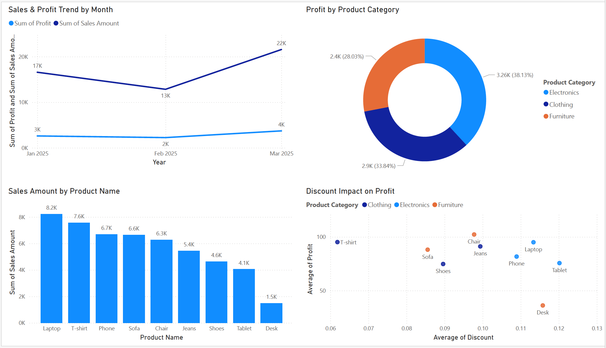

# Retail Sales Dashboard — Summary Report

---

## Data Cleaning

Before loading the data into Power BI, several issues were identified and fixed to make sure the data was accurate and ready for reporting.

The first issue was that product names and categories were completely mixed up. For example, products like Laptop and Phone were listed under Clothing, and Sofa and Chair were listed under Electronics. This was corrected by reassigning each product to its proper category — Electronics for Laptop, Phone and Tablet; Furniture for Sofa, Chair and Desk; and Clothing for Shoes, Jeans and T-shirt. Used following Power Query to fixed the issue by adding custom column.
```
= if [Product Name] = "Laptop" or [Product Name] = "Phone" or [Product Name] = "Tablet" then "Electronics"
  else if [Product Name] = "Sofa" or [Product Name] = "Chair" or [Product Name] = "Desk" then "Furniture"
  else if [Product Name] = "Shoes" or [Product Name] = "Jeans" or [Product Name] = "T-shirt" then "Clothing"
  else "Unknown"
```

The second issue was that the Discount column was stored as a decimal number such as 14 instead of a percentage value like 0.14. This was corrected by dividing all values by 100 so that Power BI could treat them as proper percentages.

The third issue was that the Order Date column included a time stamp alongside the date, showing midnight on every row. The time portion was removed so the column contains clean date values only.

---

## Dashboard Insights

### Snapshot of the Dashboard



### Chart 1 — Sales and Profit Trend by Month

Sales and profit both has decreased in February before bouncing back strongly in March. March became the best month of the three with the highest sales and profit recorded. This recovery is a positive sign for the business. However profit in March is still only around 18 cents for every dollar of sales made. Need to find a way to increase it further.

### Chart 2 — Profit by Product Category

When looking at which category makes the most profit, Electronics comes out on top bringing in 38% of total profit. Clothing is not far behind at 34%, which is impressive considering it is not being heavily discounted. Furniture is the weakest of the three, contributing only 28% of profit despite receiving some of the biggest discounts. 

### Chart 3 — Sales Amount by Product

Laptop is the best selling product by a clear margin, followed closely by T-shirt which is a strong surprise. Phone and Sofa are performing steadily in the middle. At the bottom of the chart, Desk stands out as a serious concern — it is selling nearly five times less than Laptop and is far behind every other product. Tablet and Shoes are also on the lower end compared to other products in their categories. The business should look closely at whether Desk is worth continuing to stock.


### Chart 4 — Discount Impact on Profit

Looking at how discounts affect profit, one Furniture product which is Desk stands out as a problem. It is being given the highest discount but making the least profit, meaning the discount is not helping the business at all. On the other hand, one Clothing product is doing the opposite — it has the lowest discount and one of the highest profits, which is great news. Electronics products are somewhere in the middle, with some doing well despite decent discounts. Overall the discounts across all products are not very different from each other except for T-Shirt, which suggests there is no clear plan behind how discounts are being given.


---

## Overall Summary

The business is growing with March showing strong momentum. Electronics and Clothing are the main profit drivers, led by Laptop and T-shirt. However Furniture — particularly Desk — is dragging overall performance down with low sales, high discounts and weak profit. The immediate priority should be reviewing the Furniture discount strategy and either promoting or reconsidering the Desk product line.
